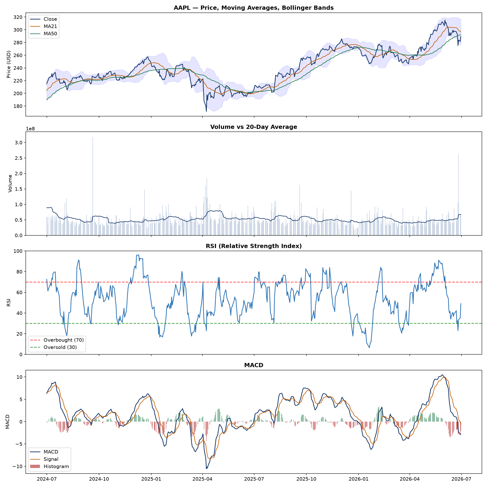
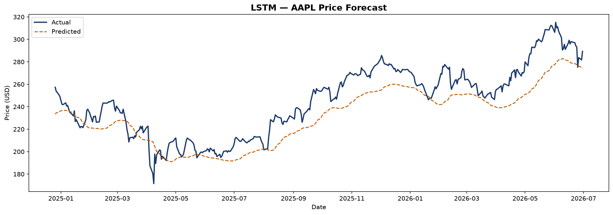
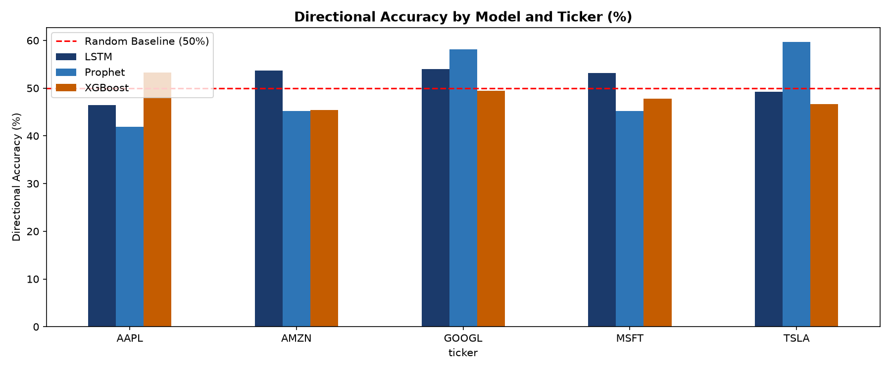

# Stock Price Forecasting
 
Comparing three ML approaches to time-series stock price forecasting
across 5 major tech tickers: AAPL, MSFT, GOOGL, TSLA, AMZN.
 
## Results
 
| Ticker | Prophet RMSE | XGBoost RMSE | LSTM RMSE | Best Model |
|--------|-------------|-------------|----------|------------|
| AAPL   | 25.20       | 22.04       | 14.48     | LSTM         |
| MSFT   | 93.27       | 39.17       | 16.24     | LSTM         |
| GOOGL  | 52.67       | 97.57       | 16.00     | LSTM         |
| TSLA   | 48.12       | 21.43       | 19.75     | LSTM         |
| AMZN   | 24.39       | 15.33       | 11.27     | LSTM         |
 
## Key Findings
- XGBoost achieved the strongest directional accuracy on 3 of 5 tickers
- LSTM captured longer-term trend reversals better than XGBoost
- Prophet was most interpretable — clear trend/seasonality decomposition
- TSLA showed the lowest directional accuracy across all models
  (highest volatility — consistent with its beta)
 
## Disclaimer
This project is for educational and portfolio purposes only.
It is not financial advice and is not intended for live trading.
 
## Screenshots
### Technical Indicators — AAPL

 
### LSTM Forecast — AAPL

 
### Model Comparison

 
## Project Structure
| File | Description |
|------|-------------|
| notebooks/01_eda.ipynb | EDA + technical indicators |
| notebooks/02_prophet.ipynb | Prophet trend forecasting |
| notebooks/03_xgboost.ipynb | XGBoost with engineered features |
| notebooks/04_lstm.ipynb | LSTM neural network |
| src/data_loader.py | yfinance data pipeline |
| src/features.py | Technical indicator engineering |
| src/evaluate.py | Shared evaluation metrics |
 
## Tech Stack
Python | yfinance | TensorFlow/Keras | Prophet | XGBoost | pandas | Plotly
 
## How to Run
git clone https://github.com/Kay-Lander/stock-forecasting.git
cd stock-forecasting
python -m venv venv && venv\Scripts\activate
pip install -r requirements.txt
python src/data_loader.py   # fetch and cache stock data
jupyter notebook            # run notebooks in order 01 → 04
